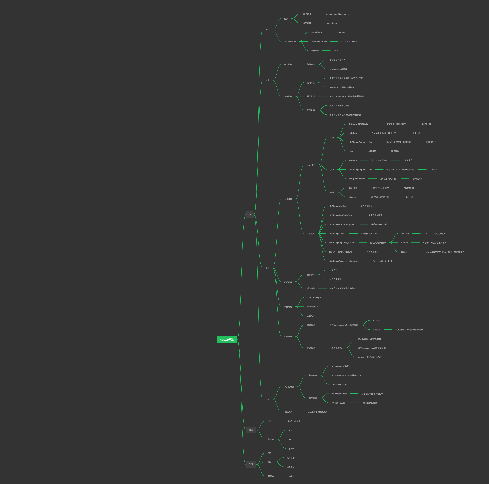

<!-- vscode-markdown-toc -->
* 1. [学习脑图](#)
* 2. [chapter-01 配置开发环境](#chapter-01chapter-01how-to-setup-dev.md)
* 3. [chapter-02 UI-布局](#chapter-02UI-)
* 4. [chapter-03 UI-路由](#chapter-03UI-)
* 5. [chapter-04 UI-组件](#chapter-04UI-)
* 6. [chapter-05 UI-动画](#chapter-05UI-)
* 7. [chapter-06 网络](#chapter-06)
* 8. [chapter-07 本地存储](#chapter-07)
* 9. [chapter-08 综合实战](#chapter-08)
* 10. [chapter-09 监控](#chapter-09)

<!-- vscode-markdown-toc-config
	numbering=true
	autoSave=true
	/vscode-markdown-toc-config -->
<!-- /vscode-markdown-toc -->

# how-to-study-flutter
Flutter学习笔记

##  1. 学习脑图

##  2. [chapter-01 配置开发环境](chapter-01/how-to-setup-dev.md)
> Android Studio如何安装和配置Flutter，以及如何在本地运行移动端模拟器

##  3. chapter-02 UI-布局

##  4. chapter-03 UI-路由

##  5. chapter-04 UI-组件

##  6. chapter-05 UI-动画

##  7. chapter-06 网络

##  8. chapter-07 本地存储

##  9. chapter-08 综合实战

##  10. chapter-09 监控